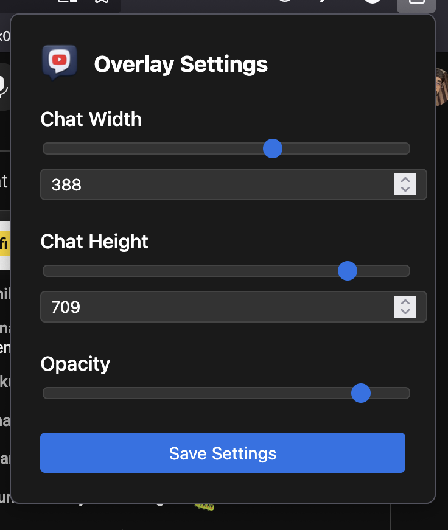

# 🚀 YouTube Live Chat Overlay  

  

📢 **Enhance your YouTube experience!**  
This Firefox extension allows you to view the **live chat overlay** while watching YouTube videos in fullscreen mode. Stay connected with the conversation without leaving fullscreen!  

---

## ✨ Features  
✅ **Live Chat Overlay** – See live chat while in fullscreen.  
✅ **Seamless YouTube Integration** – Works directly on YouTube.  
✅ **Lightweight & Fast** – Minimal performance impact.  
✅ **Customizable Settings** – Adjust overlay position and size.  

---

## 📸 Screenshots  
  
  
  
---

## 📥 Installation  

### **From Firefox Add-ons Store**
🔗 [Get it on Firefox Add-ons](https://addons.mozilla.org/addon/live-chat-overlay-youtube/)

### **Manual Installation**  
1. **Download** the latest `.zip` from [Releases](https://github.com/Pratyush2005/YouTube-Live-Chat-Overlay/releases).  
2. Open `about:debugging` in Firefox.  
3. Click **"This Firefox" → "Load Temporary Add-on"**.  
4. Select the `manifest.json` file inside the extracted folder.  

---

## ⚙️ How to Use  
1. **Install & Enable** the extension.  
2. Open **YouTube** and start watching a live stream.  
3. Click the **extension icon** to configure settings.  
4. Enjoy the chat overlay in fullscreen mode! 🎉  

---

## 🔧 Permissions  
This extension requires the following permissions:  
- `storage` – To save user settings.  
- `*://*.youtube.com/*` – To modify YouTube pages for the overlay.  

Your privacy is **100% respected** – no data is collected! 🚀  

---

## 🛠️ Development  
Want to contribute? Follow these steps:  
```bash
git clone https://github.com/Pratyush2005/YouTube-Live-Chat-Overlay.git
cd your-repo
```
- Modify the code  
- Test using **about:debugging**  
- Submit a pull request 🚀  

---

## 📜 License  
This project is licensed under the **GNU License**. See [`LICENSE`](LICENSE) for details.  

---

## 💡 Author  
Developed with ❤️ by **Pratyush Pradhan**  
🔗 GitHub: [@Pratyush2005](https://github.com/Pratyush2005)  

---

## ⭐ Support  
If you like this project, consider giving it a **⭐ on GitHub!**  

🚀 Happy Browsing!  
